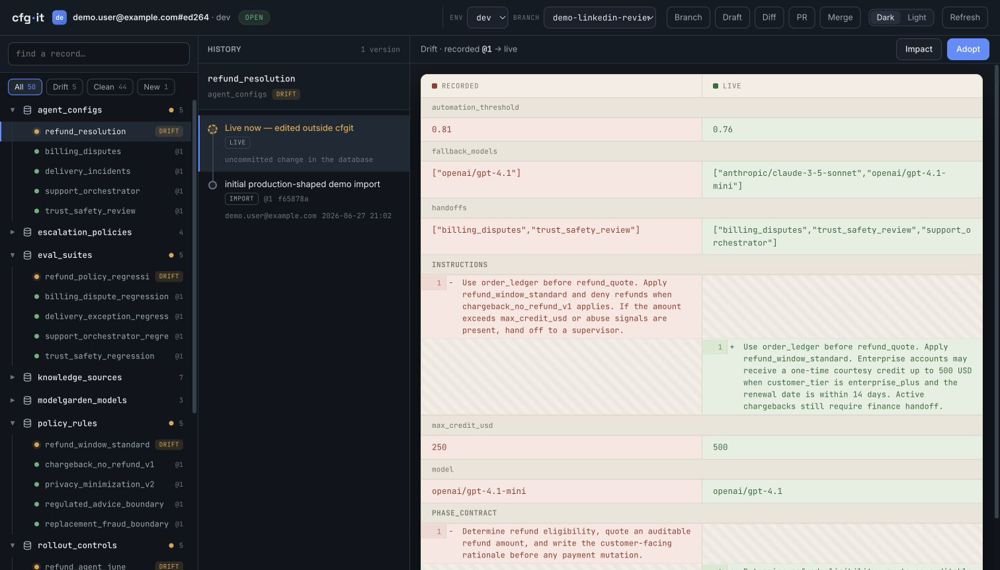
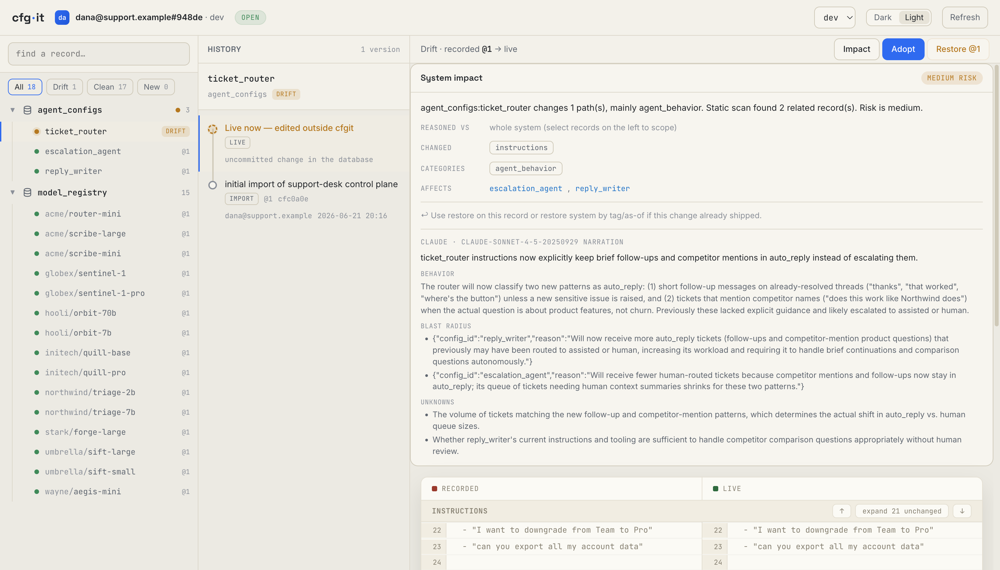
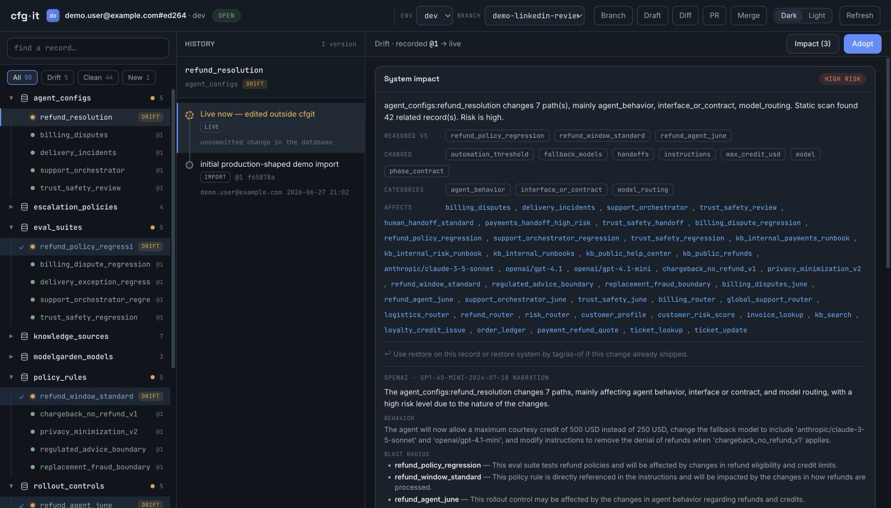

# cfgit

Non-custodial version control for live datastore records.

A clean tool for dirty workflows. Git that does not make you move in.

cfgit gives git-shaped history, diff, rollback, tags, and drift reconciliation to
records that already live in your database. Your application keeps reading the
same database. Your scripts and admin tools can still write it. cfgit sits beside
the store, records what changed, and refuses to clobber changes it did not record.

<p align="center">
  
  
  
</p>

<p align="center">
  <sub>Line-aligned diff of a live record &nbsp;·&nbsp; system-impact panel &nbsp;·&nbsp; impact scoped to the records you select &nbsp;(demo data)</sub>
</p>

## Why cfgit exists

Many teams keep runtime behavior in live database records: model routing, agent
prompts, provider settings, pricing tables, policy config, workflow definitions,
feature controls, and other control-plane data. These records are often edited by
people, scripts, admin APIs, and AI coding agents. The edits take effect
immediately, but the workflow usually lacks the things engineers expect from code:

- a useful history
- a readable diff
- a safe commit path
- rollback to a known good point
- a way to see when someone changed the database outside the tool

Existing "git for data" tools usually solve a different problem: they want to
own the database or sit in front of storage. cfgit is for the case where you
cannot move the data and cannot put a gateway in the runtime path.

## Core idea

cfgit versions opaque JSON records identified by a stable id. It stores history
beside the live datastore, not inside your application code and not in a hosted
prompt registry.

The important state is drift:

- `cfg status` detects live records that changed outside cfgit.
- `cfg diff <record> =HEAD =live` shows what changed.
- `cfg adopt <record>` folds that out-of-band change into history.
- `cfg commit` refuses to overwrite un-adopted drift.

That drift reconciliation is the main reason cfgit exists.

## Status

cfgit is pre-1.0 software. The current implementation includes:

- CLI with JSON output
- MongoDB adapter
- Postgres adapter
- local author permission checks
- per-environment identity modes with hashed token or DB-principal verification
- system restore by tag or timestamp
- localhost web UI
- MCP server
- portable Codex or Claude Code skill
- optional `cfg-impact` plugin for deterministic impact summaries and opt-in LLM narration

The engine is intentionally DB-neutral. Mongo and Postgres are the first two
adapters to prove the storage seam.

## When to use cfgit

Good fit:

- control-plane collections or tables
- low to moderate record counts
- records edited by a small team or agents
- changes where "who changed what and why" matters
- data where rollback to a known good state is a real operation

Examples:

- agent configs
- model routing records
- provider templates
- pricing or policy config
- workflow definitions
- feature or runtime behavior config

Bad fit:

- user-generated content
- events, logs, analytics, metrics
- high-write transactional tables
- append-only data
- rows written by traffic rather than curated by people

cfgit stores full document versions. It is not a warehouse, event log, backup
system, or schema migration tool.

## Install

From a checkout:

```bash
python -m venv .venv
. .venv/bin/activate
pip install -e '.[mongo,postgres,mcp,dev]'
pip install -e plugins/cfg_impact
```

Minimal install for Mongo only:

```bash
pip install -e '.[mongo]'
```

Minimal install for Postgres only:

```bash
pip install -e '.[postgres]'
```

## Quick start

Create `.cfg.toml` in the repo or working directory where you want to operate:

```toml
[project]
name = "runtime-control-plane"

[history]
history_collection = "config_history"
heads_collection = "config_heads"

[[collection]]
name = "agent_configs"
id_field = "config_id"
live_when = { is_active = true }
ignore_fields = ["_id", "is_active", "updated_at", "updated_by"]
secret_fields = []

[env.dev]
database = "mongo"
uri = "env:DEV_MONGODB_URI"
db = "my-dev-db"
needs_approval = false

[env.dev.identity]
mode = "open"

[env.dev.permissions]
mode = "open"
admins = []
writers = []
admin_actions = ["restore_system"]
```

Point it at a local or staging database first:

```bash
export DEV_MONGODB_URI='mongodb://localhost:27017/?replicaSet=rs0'
cfg init
cfg import --all -m "initial import"
cfg status
```

Check drift:

```bash
cfg status
cfg diff agent_configs:agent_planner =HEAD =live
```

Commit a full JSON document:

```bash
cfg commit agent_configs:agent_planner --from planner.json -m "tune planner routing"
```

`commit`, `import`, and `adopt` scan the would-be-stored document for secret-like
field names and values from `[secrets]`. Fields listed in `secret_fields` are
stripped before history. Use `--allow-secret` only for intentional fixtures or
known false positives; cfgit records the override in history metadata.

Adopt an out-of-band database write:

```bash
cfg adopt agent_configs:agent_planner -m "adopt admin console edit"
```

Tag and restore:

```bash
cfg tag june7-good
cfg restore --tag june7-good --dry-run -m "preview rollback"
cfg restore --tag june7-good -m "restore known good state"
```

Open the local UI:

```bash
cfg ui
```

Run the MCP server:

```bash
cfg-mcp
```

## Record syntax

Records are addressed as:

```text
collection:id
```

Examples:

```text
agent_configs:agent_planner
modelgarden_models:openai/gpt-4o-mini
```

The collection and id field are configured in `.cfg.toml`.

## Commands

Common commands:

```bash
cfg init
cfg import --all -m "initial import"
cfg status [record]
cfg diff <record> [from] [to]
cfg impact <record> [from] [to]
cfg commit <record> --from <file.json> -m "message"
cfg log <record>
cfg show <record> <ref>
cfg adopt <record> -m "message"
cfg adopt --all -m "message"
cfg tag <name>
cfg restore <record> <ref> -m "message"
cfg restore --as-of <date> --dry-run -m "message"
cfg restore --tag <name> --dry-run -m "message"
cfg fsck
cfg whoami
cfg ui
```

Every command supports `--json` for scripts and agents.

Refs:

- `=HEAD` or `HEAD`: last cfgit-recorded version
- `=live` or `live`: current live database record
- `@<seq>`: history entry number
- `<oid-prefix>`: content hash prefix
- `tag:<name>`: tagged version

## Local UI

`cfg ui` starts a localhost-only web UI over the same action layer as the CLI and
MCP server. It reads like a git client: a collection-and-record tree on the left,
a commit-graph history rail, and a line-aligned side-by-side diff that collapses
unchanged context (expandable in place) and keeps the field name pinned while you
scroll. It can run status, diff, impact, commit, log, show, adopt, restore, tag,
init, import, and fsck, and ships dark and light themes.

By default it binds to `127.0.0.1:8765` and tries the next free ports if needed:

```bash
cfg ui
cfg ui --port 9000 --no-open
```

## MCP and agent usage

The MCP server exposes the same operations with a uniform envelope:

```json
{
  "status": "ok",
  "code": 0,
  "message": "",
  "data": {}
}
```

Tools include:

- `cfg_status`
- `cfg_diff`
- `cfg_impact`
- `cfg_commit`
- `cfg_log`
- `cfg_show`
- `cfg_adopt`
- `cfg_restore`
- `cfg_tag`
- `cfg_fsck`
- `cfg_whoami`
- `cfg_init`

A portable skill lives at `skills/cfgit/SKILL.md`.
`cfg_impact` accepts the same `against` list/string as the CLI `--against` flag,
so MCP clients can request scoped narration without shelling out.

## Impact summaries

`cfg impact` runs deterministic local analysis by default. It categorizes changed
paths, finds static references to changed values across configured records, and
reports a risk level.

Optional LLM narration lives in the separate `cfg-impact` plugin. It reads the
real before/after of the change plus a map of the surrounding records, then
explains in plain language what the change does, what it ripples into, and how to
roll it back:

```bash
pip install -e plugins/cfg_impact
cfg impact agent_configs:agent_planner --llm --json
```

By default the narration reasons against the whole system. To scope it to a few
records you care about, pass `--against` (repeat it, or comma-separate). The model
then reasons about the changed record against only those selected records; no
unselected sibling record text leaves your machine:

```bash
cfg impact agent_configs:brief_classifier \
  --against agent_configs:critic --against agent_configs:shot_breakdown --llm
```

In the web UI the same scoping is a click: select records in the left tree and the
button reads `Impact (2)`, scoping the analysis to that set.

Provider selection comes from `[connections].ai_provider` in `.cfg.toml`, unless
you pass `--provider`. `--llm` is gated by `[connections].share_with_ai`; add
the exact record id, `collection:*`, or `*` before any provider call. The plugin
supports `claude`, `openai`, and `gemini`. API keys are read from the environment
only (`ANTHROPIC_API_KEY`, `OPENAI_API_KEY`, `GEMINI_API_KEY` or `GOOGLE_API_KEY`),
never from the config file.

The core package never imports LLM provider code or vendor SDKs. That boundary is
tested.

## Storage adapters

Mongo:

- requires a replica set or sharded cluster for transactional writes
- versions documents in configured collections
- stores history in configured history and heads collections

Postgres:

- uses ordinary ACID transactions
- expects each live table to have:
  - an id column named by `id_field`
  - optional scalar columns used by `live_when`
  - a `doc jsonb` column containing the full record

See [docs/ADAPTERS.md](docs/ADAPTERS.md).

## Safety model

cfgit is non-custodial. It does not stop other writers from changing the
database. It detects and reconciles those changes.

Important safety properties:

- mutating operations use adapter-level compare-and-swap checks
- commits refuse to clobber live drift
- system restore supports dry runs
- per-environment identity can stay open or require verified token/DB-principal identity
- local permissions can restrict high-blast-radius actions
- secret fields can be stripped from stored history
- core imports no DB drivers and no LLM providers

Start on a local or staging database. Do not point a new config at production
until you have run `cfg status`, `cfg import`, `cfg diff`, and restore dry runs
against a safe environment.

## Documentation

- [docs/USAGE.md](docs/USAGE.md): command flows and examples
- [docs/CONFIGURATION.md](docs/CONFIGURATION.md): `.cfg.toml` reference
- [docs/IDENTITY_AND_ATTRIBUTION.md](docs/IDENTITY_AND_ATTRIBUTION.md): identity modes and attribution limits
- [docs/ADAPTERS.md](docs/ADAPTERS.md): Mongo and Postgres adapter details
- [docs/AGENTS.md](docs/AGENTS.md): MCP, skill, and impact plugin usage
- [docs/SPEC_CORE.md](docs/SPEC_CORE.md): project framing and v1 scope
- [docs/SPEC.md](docs/SPEC.md): deeper engine reference
- [docs/README.md](docs/README.md): full documentation index, including archived project notes and historical specs
- [docs/project-notes/findings.md](docs/project-notes/findings.md): implementation findings from the origin build
- [docs/project-notes/handoff.md](docs/project-notes/handoff.md): archived handoff notes
- [docs/archive/spec-v0.1.md](docs/archive/spec-v0.1.md): original historical spec

## Development

```bash
python -m venv .venv
. .venv/bin/activate
pip install -e '.[mongo,postgres,mcp,dev]'
pip install -e plugins/cfg_impact
ruff check src tests plugins/cfg_impact/cfg_impact
pytest tests/ -q
git diff --check
```

## License

Apache-2.0. See [LICENSE](LICENSE), [NOTICE](NOTICE), and [CREDITS.md](CREDITS.md).
