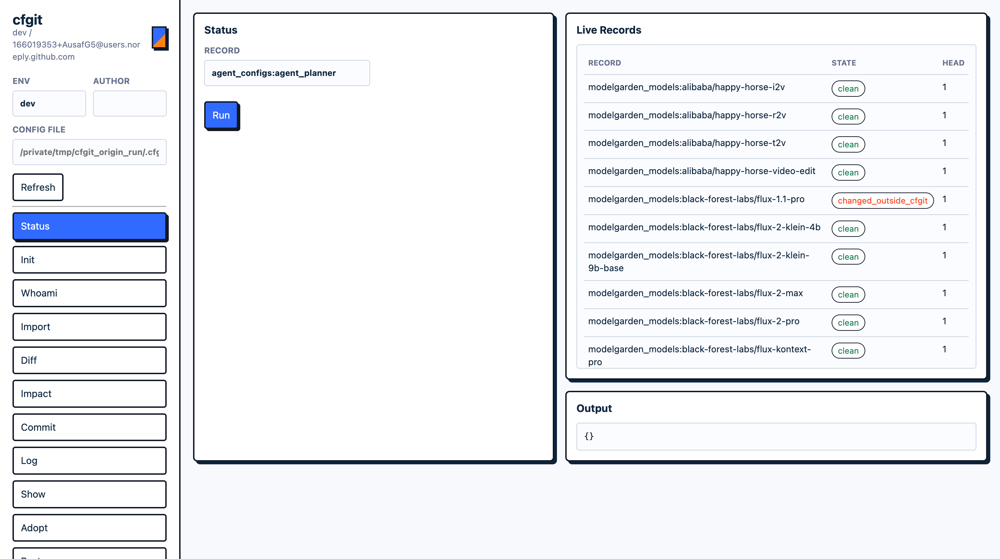
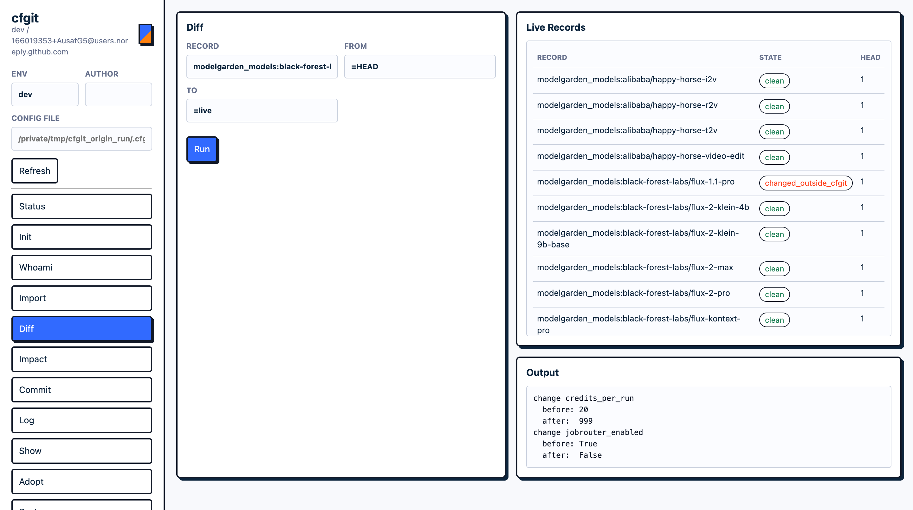
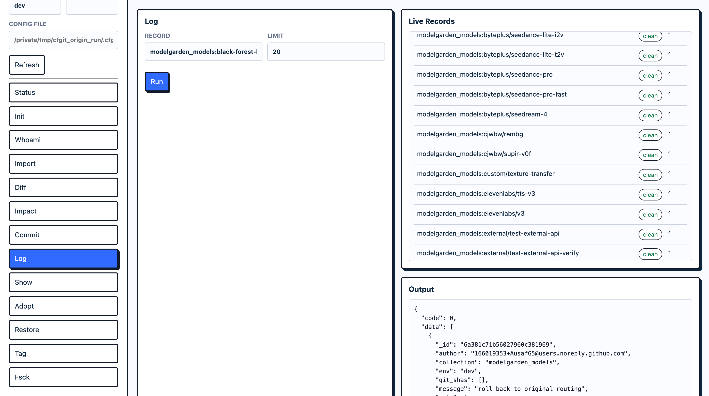
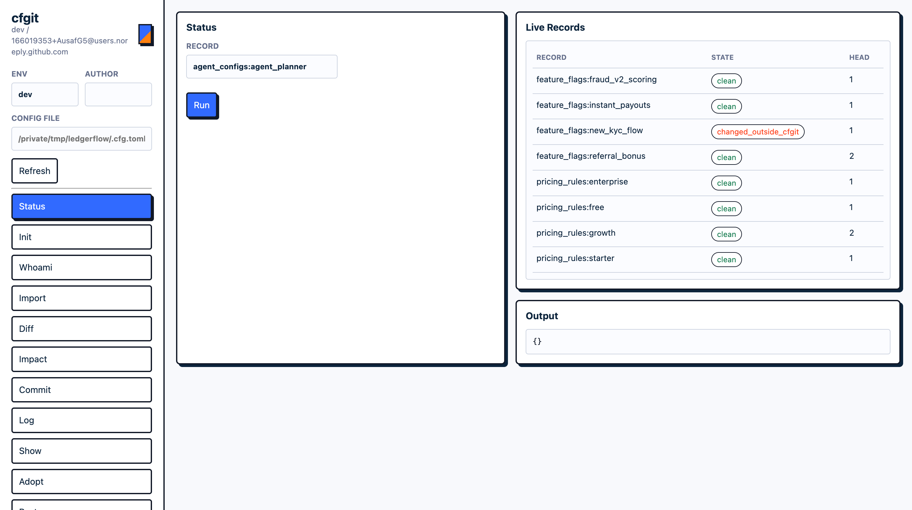
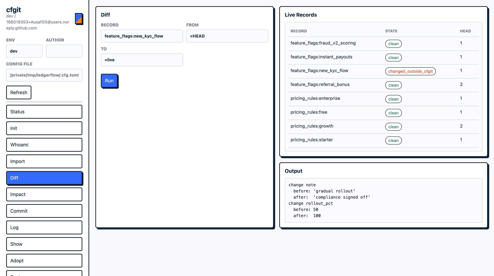
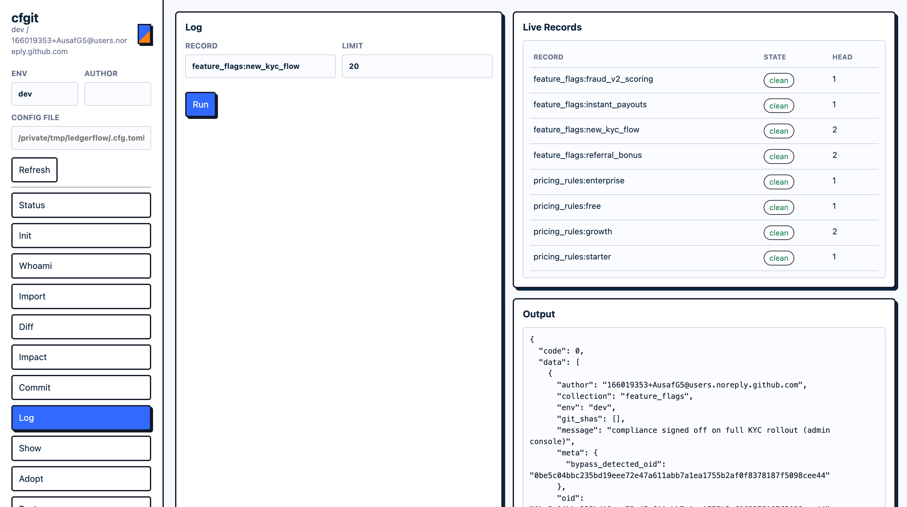

# Screenshots

cfgit ships a small read-only web UI (`cfg ui`) over the same engine the CLI uses. The shots
below are real runs against two very different stacks: an AI model-routing config, and a fintech
feature-flag / pricing config. Same tool, same five-minute setup, no runtime migration in either
case.

> To merge into the README: paste this under a `## Screenshots` heading and adjust image paths
> if `docs/screenshots/` moves. Images live in `docs/screenshots/`.

## Drift detection across a live config collection

The status view lists every live record and its state. Records edited through cfgit read `clean`;
a record changed directly in the database, behind cfgit's back, is flagged `changed_outside_cfgit`.
This drift detection is the thing off-the-shelf "git for data" tools do not do, because they own
all writes and cfgit deliberately does not.

*An AI model router (`modelgarden_models`): live models clean, one (`flux-1.1-pro`) flagged as
changed outside cfgit after a teammate edited its routing directly in Mongo.*

## See exactly what changed outside the tool

`diff` shows the field-level delta between the version cfgit recorded and what is live now, so you
can see precisely what an out-of-band edit did before deciding to keep it or roll it back.

*The drift on `flux-1.1-pro`, field by field: `credits_per_run` 20 to 999, `jobrouter_enabled`
True to False. Nothing was guessed; this is the recorded version vs the live document.*

## History and rollback for records that live in your database

Every change is a new version on top, never a destructive rewrite, so the full history is queryable
and any past version can be restored. "Put it back to how it was on the 7th" becomes one command.

*Version history for a record, read straight from cfgit's history store: author, message, and the
full entry. A restore is a new version whose content equals the old one, so nothing is lost.*

## Works on any control-plane collection, not just AI configs

cfgit versions opaque JSON records keyed by a stable id; it does not care what the records mean.
Point it at feature flags, pricing rules, routing tables, policy config, anything a small team
hand-edits and needs to roll back. The shots below are a fintech control plane (`feature_flags` +
`pricing_rules`), stood up from scratch the same way.

*Two collections at once (`feature_flags` and `pricing_rules`): a flag (`new_kyc_flow`) flagged as
changed outside cfgit after it was edited through an admin console; everything else clean.*

*What the admin-console edit changed: `rollout_pct` 50 to 100, and the note. Same field-level diff,
a completely different domain than AI configs.*

*The flag's history after the out-of-band change was adopted with attribution. The entry records
`meta.bypass_detected_oid`, so the audit trail shows this version came from a write that bypassed
cfgit and was folded back in, not lost.*
